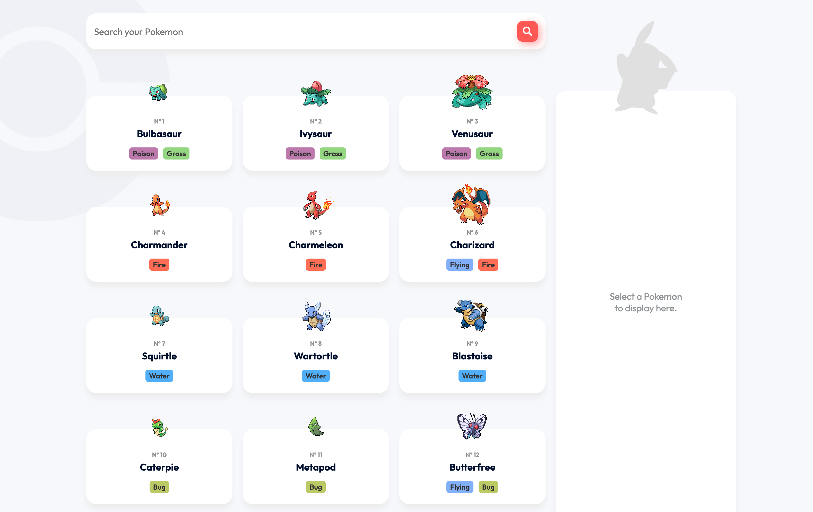

# Pokedex



Essa aplicação é para mostrar os principios básicos de HTML e CSS, realizando um consumo da [PokeAPI](https://pokeapi.co/) e exibindo o detalhe do pokemon selecionado.

## :rocket: Tecnologias

- [x] [Javascript](https://developer.mozilla.org/pt-BR/docs/Web/JavaScript)
- [x] [Fetch()](https://developer.mozilla.org/pt-BR/docs/Web/API/fetch)
- [x] [HTML](https://developer.mozilla.org/pt-BR/docs/Web/HTML)
- [x] [CSS](https://developer.mozilla.org/pt-BR/docs/Web/CSS)

## Fluxo da aplicação

Assim que ela inicia, já busca todos os animais e todos as suas características.

Clicando em qualquer animal, ele mostra os detalhes.

### Acessando a aplicação

[Clique aqui para acessar](https://pokemon.desenvbr.com)


## Configurando ambiente

Não é necessário nenhuma configuração para rodar o projeto, apenas abrir no navegador o arquivo:
```text
index.html
```

### API

Foi utilizado a [PokeAPI](https://pokeapi.co/) e foi colocado direto no arquivo javascript o consumo da mesma.

### DESIGN

Layout feito por [Design by AC1design](https://dribbble.com/shots/15128634-Pokemon-Pokedex-Website-Redesign-Concept) 

